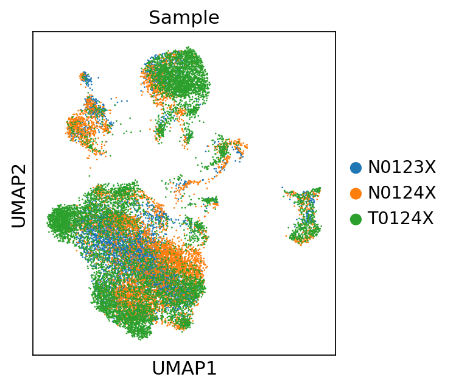
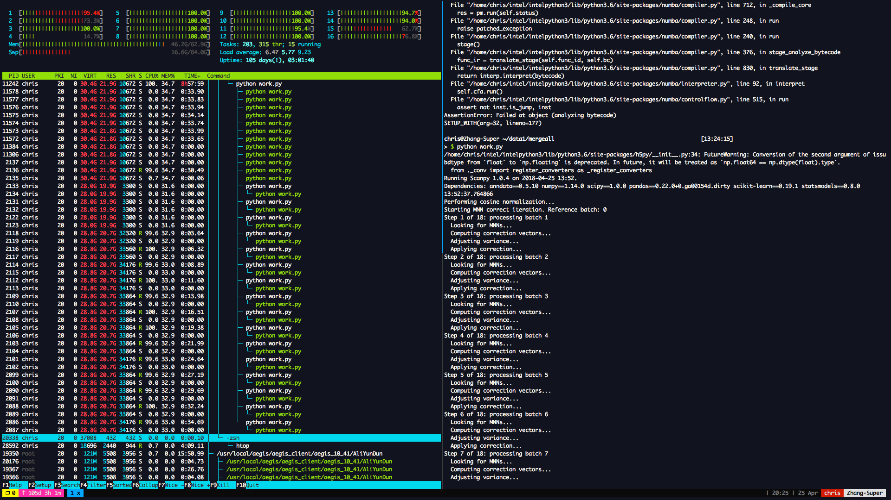

[](https://travis-ci.org/chriscainx/mnnpy) [](http://pepy.tech/count/mnnpy)
# mnnpy - MNN-correct in python!

An implementation of MNN correct in python featuring low memory usage, full multicore support and compatibility with the [scanpy](https://github.com/theislab/scanpy) framework.

Batch effect correction by matching mutual nearest neighbors [(Haghverdi et al, 2018)](https://www.nature.com/articles/nbt.4091) has been implemented as a function 'mnnCorrect' in the R package [scran](https://bioconductor.org/packages/release/bioc/html/scran.html). Sadly it's extremely slow for big datasets and doesn't make full use of the parallel architecture of modern CPUs.

This project is a python implementation of the MNN correct algorithm which takes advantage of python's extendability and hackability. It seamlessly integrates with the [scanpy](https://github.com/theislab/scanpy) framework and has multicore support in its bones. 

## Status
- ver 0.1.9.5: corrected a bug with cos_norm. Thank @LisaSikkema
- in the latest version of SCRAN, the default value of sigma is now 0.1. We are still keeping the 1.0 in mnnpy due to some reports that 1.0 is better. You are recommended to try out this new setting and find what’s best for your data. Thank @yueqiw
- ver 0.1.9.4: added a fix for sparse matrix normalization. Thank @zacharylau10
- ver 0.1.9.3: fixed potential multiprocessing bug. set `mnnpy.settings.normalization = 'seq'` to perform normalization sequentially and avoid strange multiprocessing problems. Thank @LucasESBS and @julien-kann
- ver 0.1.9.2: fixed an error in subtract_bio_span. Thank @dylkot
- ver 0.1.9: replacing python's notorious multiprocessing with openmp-based multithreading. Reduced **huge** memory overhead, saving both (a lot of) time and (a lot of) memory. **PLEASE UPDATE TO THIS VERSION** 
- ver 0.1.8: changed multiprocess chunck size for *significant* speedup
- ver 0.1.7: rewrote adjust_shift_variance in Cython for performance gain. 
- TODO: optimize compute_correction

Please help me test it and file in any issues.

**JIT speed up** from [numba](http://numba.pydata.org) is currently used. 

Consider using [**Intel Math Kernel Library**](https://software.intel.com/en-us/mkl)-enabled python environment or [**Intel Python Distribution**](https://software.intel.com/en-us/distribution-for-python) for better performance on Intel CPUs.

Further speed up with **C++/Cython/Tensorflow/CUDA** is on our bucket list and being developed!

## Speed

Finishes correcting ~50000 cells/19 batches * ~30000 genes in ~12h on a 16 core 32GB mem server.

## Highlights

- High CPU utilization
- Low mem consumption
- Extendable/hackable
- Compatible with scanpy
- Full verbosity

## Install

Mnnpy is available on PyPI. You can install with `pip install mnnpy`.

If you want the developing version, do:
```
git clone https://github.com/chriscainx/mnnpy.git
cd mnnpy
pip install .
```

## Usage

Mnnpy takes matrices or AnnData objects. For example:
```python
import scanpy.api as sc
import mnnpy

sample1 = sc.read("Sample1.h5ad")
sample2 = sc.read("Sample2.h5ad")
sample3 = sc.read("Sample3.h5ad")
hvgs = load_from_file("Some HVGs.csv")
corrected = mnnpy.mnn_correct(sample1, sample2, sample3, var_subset=hvgs, batch_categories = ["N0123X", "N0124X", "T0124X"])
adata = corrected[0]
```
> Running Scanpy 1.0.4 on 2018-04-25 13:39.  
Dependencies: anndata==0.5.10 numpy==1.14.0 scipy==1.0.0 pandas==0.22.0+0.ga00154d.dirty scikit-learn==0.19.1 statsmodels==0.8.0  
Performing cosine normalization...  
Starting MNN correct iteration. Reference batch: 0  
Step 1 of 2: processing batch 1  
--Looking for MNNs...  
--Computing correction vectors...  
--Adjusting variance...  
--Applying correction...  
Step 2 of 2: processing batch 2  
--Looking for MNNs...  
--Computing correction vectors...  
--Adjusting variance...  
--Applying correction...  
MNN correction complete. Gathering output...   
Packing AnnData object...  
Done.  
```python
adata
```
> AnnData object with n_obs × n_vars = 20270 × 33694  
    obs: 'n_genes', 'percent_mito', 'n_counts', 'Sample', 'Donor', 'Tissue', 'batch'  
    var: 'gene_ids-0', 'n_cells-0', 'gene_ids-1', 'n_cells-1', 'gene_ids-2', 'n_cells-2'  
```python
bdata = adata[:, hvgs]
sc.pp.scale(bdata)
sc.pp.neighbors(bdata)
sc.tl.umap(bdata)
sc.pl.umap(bdata, color='Sample')
```
> 

For further information do `help(mnnpy.mnn_correct)` in python to read the function docstring, or wait for me to write the docs...

## Best practice

It is recommended to pass log-transformed matrices/AnnData objects to `mnn_correct`, and use HVGs instead of all the genes.

## Screenshot



## Credits

Algorithm is from Laleh Haghverdi and Aaron T. L. Lun.

.irlb is copied from airysen/irlbpy, couldn't figure out how to make it a symbolic link from the submodule though😂
